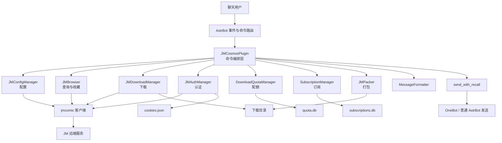
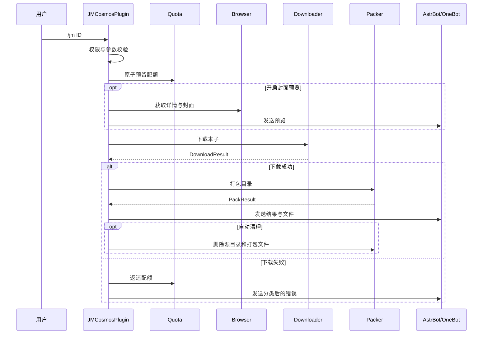

# JM-Cosmos II 项目架构说明

本文基于 v2.7.6 源码梳理，面向后续开发、排障与重构。项目是运行在 AstrBot 内的 JM 漫画查询、下载和管理插件，以 `jmcomic` 为远端访问与下载内核。

## 1. 项目定位

- 插件标识：`jm_cosmos2`
- 运行宿主：AstrBot
- Python：3.10+
- 核心依赖：`jmcomic`、`pymupdf`、`pyzipper`；`Pillow` 由 `jmcomic` 间接引入并用于长图与图片压缩
- 主要能力：搜索、详情、排行、推荐、下载、打包、登录、收藏、配额限制、更新订阅和消息自动撤回
- 主要入口：`main.py` 中的 `JMCosmosPlugin`

该项目采用“命令编排层 + 核心业务层 + 展示/平台工具层”的轻量分层结构，没有独立的领域模型层或依赖注入容器。

## 2. 总体架构



核心设计原则如下：

1. `main.py` 只直接面对 AstrBot 事件，对业务服务进行编排。
2. `jmcomic` 是可选依赖，插件缺少它时仍可加载，但相关命令会返回依赖缺失提示。
3. `jmcomic` 的同步调用通过 `asyncio.to_thread` 进入线程池，避免阻塞 AstrBot 事件循环。
4. 每次远端操作创建独立客户端，避免并发共享同一个 client 引发状态竞态；登录态通过共享的 `JmOption` Cookie 传播。
5. 下载、打包、发送是三个独立阶段，使用 `DownloadResult` 和 `PackResult` 传递结果。

## 3. 目录与模块职责

```text
astrbot_plugin_jm_cosmos/
├── main.py                    # 插件注册、命令处理、业务编排、订阅后台任务
├── _conf_schema.json          # AstrBot 管理面板配置定义
├── metadata.yaml              # 插件名称、版本、作者和仓库信息
├── requirements.txt           # 运行依赖
├── pyproject.toml             # Python 项目元数据
├── pytest.ini                 # pytest 路径、异步模式和标记配置
├── core/
│   ├── base/
│   │   ├── config.py          # 配置读取、校验及 JmOption 构造
│   │   └── client.py          # 客户端创建和同步转异步公共能力
│   ├── auth.py                # 登录、登出、Cookie 恢复与持久化
│   ├── browser.py             # 搜索、详情、封面、排行、推荐和收藏
│   ├── downloader.py          # 本子/章节下载、增量过滤、进度统计
│   ├── packer.py              # ZIP、PDF、长图打包与清理
│   ├── quota.py               # SQLite 每用户每日下载配额
│   ├── subscribe.py           # SQLite 会话级更新订阅
│   ├── constants.py           # 分类、排序、时间、搜索模式映射
│   ├── errors.py              # 底层异常到用户错误类型的映射
│   └── jmcomic_loader.py      # jmcomic 的探测和惰性导入
├── utils/
│   ├── formatter.py           # 所有面向用户的文本格式化
│   ├── recall.py              # OneBot 发送、压图重试及延迟撤回
│   └── filename.py            # 输出文件名生成与清洗
└── tests/
    ├── unit/                  # 隔离外部依赖的单元测试
    └── integration/           # 访问真实服务的集成测试
```

## 4. 启动与生命周期

`JMCosmosPlugin.__init__` 的初始化顺序是：

1. 通过 `StarTools.get_data_dir("jm_cosmos2")` 获取插件数据目录；失败时回退到插件目录下的 `data/`。
2. 创建 `JMConfigManager`。
3. 创建下载、浏览和认证管理器。
4. 创建 `quota.db`，并清理七天前的配额记录。
5. 创建 `subscriptions.db`。
6. 若启用调试模式，开启 `jmcomic` 的 HTML 解析失败页面转储。
7. 若 `subscribe_check_interval > 0`，启动订阅轮询后台任务。

卸载时，`terminate()` 会取消并等待订阅任务结束。其余服务没有常驻连接，SQLite 连接均按操作创建并关闭，因此不需要额外释放。

## 5. 命令层

命令均由 `@filter.command` 注册，集中在 `main.py`。

| 命令 | 入口方法 | 核心服务 | 作用 |
| --- | --- | --- | --- |
| `/jmhelp` | `help_command` | `MessageFormatter` | 输出帮助 |
| `/jm` | `download_album_command` | Browser、Downloader、Packer、Quota | 下载完整本子 |
| `/jmc` | `download_photo_command` | Browser、Downloader、Packer、Quota | 按章节序号下载 |
| `/jms` | `search_command` | Browser | 综合或按标签、作者、角色、作品搜索 |
| `/jmi` | `info_command` | Browser | 查询详情和可选封面 |
| `/jmrank` | `ranking_command` | Browser | 日、周、月排行 |
| `/jmrec` | `recommend_command` | Browser | 分类、排序、时间组合浏览 |
| `/jmlogin` | `login_command` | Auth | 私聊登录 |
| `/jmlogout` | `logout_command` | Auth | 清除本地登录态 |
| `/jmstatus` | `status_command` | Auth | 查看当前登录状态 |
| `/jmfav` | `favorites_command` | Auth、Browser | 收藏列表、添加或取消收藏 |
| `/jmsub` | `subscribe_command` | Browser、Subscription | 保存当前会话的更新订阅 |
| `/jmunsub` | `unsubscribe_command` | Subscription | 取消订阅 |
| `/jmsublist` | `subscription_list_command` | Subscription | 查看当前会话订阅 |
| `/jmupdate` | `update_command` | Browser、Downloader、Packer、Subscription、Quota | 下载订阅记录之后的新增章节 |

多数业务命令先经过 `_check_permission()`：

- `admin_only=false` 时不限制用户，否则要求发送者位于 `admin_list`。
- `enabled_groups` 为空时允许所有群，否则只允许白名单群。
- 私聊没有群 ID，因此只受管理员规则影响。

下载类命令还会调用 `_reserve_quota()`。管理员与不限额配置跳过计数；普通用户在下载前原子预留次数，下载失败时在 `finally` 中返还。

## 6. 核心业务组件

### 6.1 配置管理 `JMConfigManager`

配置源来自 AstrBot 的 `AstrBotConfig`，由 `_conf_schema.json` 定义管理面板字段。管理器通过只读属性统一提供字符串、布尔值、数值、集合和路径。

`create_jm_option()` 把插件配置转换成 `jmcomic.JmOption`：

- 下载目录规则使用 `Bd/Aid/Pindex`，即“基目录 / 本子 ID / 章节序号”，避免章节图片互相覆盖。
- 图片后缀、章节并发数、图片并发数写入下载配置。
- 客户端支持 `api` 或 `html`。
- 域名和重试次数仅在用户显式配置时覆盖默认值。
- 未启用代理时显式写入空代理，避免 Docker 或运行环境中的系统代理被意外继承。

构造后的 `JmOption` 会被缓存。它既承载静态配置，也承载登录后注入的 Cookie。

### 6.2 公共客户端能力 `JMClientMixin`

Browser、Downloader 和 Auth 复用该 Mixin：

- `_get_option()` 获取缓存的 `JmOption`。
- `_build_client()` 每次创建新的 `jmcomic` client。
- `_run_sync()` 使用 `asyncio.to_thread()` 包装同步调用。
- `is_available()` 在运行时确认 `jmcomic` 能否真正导入。

“共享 Option、独立 Client”是本项目处理登录态与并发隔离的关键。

### 6.3 浏览查询 `JMBrowser`

该组件负责所有非下载型远端访问：

- 搜索：将 `site/tag/author/actor/work` 映射到不同的 `jmcomic` 搜索方法。
- 详情：把 `jmcomic` 对象转换成普通字典，隔离上层与第三方模型。
- 章节定位：根据用户输入的 1 基序号从 `episode_list` 取得 photo ID。
- 封面：下载到 `<download_dir>/covers/`。
- 排行和推荐：使用常量表将用户参数转换成 API 参数。
- 收藏：复用认证 Option 的 Cookie，但仍按操作创建独立 client。

收藏 API 是切换语义而不是设置语义。API 客户端会先读取 `is_favorite`，仅在当前状态与目标状态不一致时 POST；HTML 客户端无法可靠预检，采用 best-effort 切换。

### 6.4 下载 `JMDownloadManager`

下载管理器提供本子与单章两个入口，内部定义了一个惰性创建的 `JmDownloader` 子类来记录进度。

进度口径：

- 多章节本子按章节计数。
- 单章节本子或 `/jmc` 按图片计数。
- 后台每两秒轮询一次，仅跨越约 10% 的桶时通知，避免刷屏。

增量下载通过 `skip_photos` 在 downloader 的 `do_filter()` 中跳过已有章节。由于第三方库的 `all_success` 对过滤后的章节数判断不适用，增量场景改为根据真实失败列表判断完整性。

下载结果统一封装为 `DownloadResult`，包含路径、标题、作者、章节/图片数、失败数和完整性状态。

### 6.5 打包 `JMPacker`

支持四种结果：

- `zip`：无密码使用标准库；有密码使用 `pyzipper` 和 AES。设置密码但缺少 `pyzipper` 时直接失败，不会静默生成未加密文件。
- `pdf`：用 PyMuPDF 将每张图片转换为 PDF 页面，可使用 AES-256 加密。
- `long_img`：Pillow 统一缩放至 1200 像素宽并纵向拼接；单段输出 PNG，多段输出 ZIP。
- `none`：不打包，保留下载目录，也不会作为文件消息发送。

图片通过递归扫描收集，并按路径中的数字自然排序，保证章节 `2` 排在 `10` 之前。`cleanup()` 负责删除产物或源目录。

### 6.6 认证 `JMAuthManager`

登录是进程级、插件实例共享的，不按聊天用户隔离：

1. 登录成功后，从 client 提取 Cookie。
2. Cookie 注入共享 `JmOption`，使后续新 client 自动带登录态。
3. 用户名和 Cookie 写入 `cookies.json`。
4. 插件重启时读取文件并恢复 Option Cookie。

`ensure_logged_in()` 优先使用已恢复的会话；若没有会话但管理面板配置了账号密码，则自动登录。

### 6.7 配额 `DownloadQuotaManager`

`quota.db` 的主键为 `(user_id, date)`。`reserve()` 使用 `BEGIN IMMEDIATE` 在单一事务中完成检查与自增，避免并发请求的 TOCTOU 超额问题。

数据库异常采用 fail-open：记录警告但允许下载，以可用性优先。失败下载通过 `refund()` 回退一次计数，且最低为零。

### 6.8 订阅 `SubscriptionManager`

`subscriptions.db` 以 `(umo, album_id)` 为主键，其中 `umo` 是 AstrBot 的统一消息来源，因而订阅粒度是“会话 + 本子”，而不是单纯用户。

后台任务启动后先等待 30 秒，之后按配置间隔轮询；实际最短间隔为 60 秒。每条订阅之间暂停 2 秒以降低远端风控风险。发现章节数增加时先更新数据库，再通过 `context.send_message()` 向原会话推送通知。

## 7. 关键业务流程

### 7.1 完整下载



### 7.2 增量更新

`/jmupdate` 从订阅记录读取 `last_count`，查询当前章节数后，把差值作为提示，并将 `last_count` 作为 `skip_photos` 交给 Downloader。成功后同步更新订阅章节数，再复用统一的文件发送与清理逻辑。

未订阅的本子没有历史章节数，因此 `/jmupdate` 等同于完整下载。

### 7.3 登录与收藏

```text
/jmlogin -> Auth.login -> jmcomic client.login
         -> 提取 Cookie -> 注入共享 Option -> cookies.json

/jmfav -> Auth.ensure_logged_in -> Auth.get_client
       -> Browser 获取列表或切换收藏 -> Formatter 输出
```

## 8. 消息展示与平台适配

`MessageFormatter` 集中维护详情、搜索、排行、推荐、收藏、订阅、下载进度、帮助和错误文本，避免核心模块拼装用户消息。

普通消息通过 AstrBot 的 `yield event.*_result()` 返回。开启自动撤回时调用 `send_with_recall()`：

- 非 `aiocqhttp` 平台回退到 `event.send()`，不撤回。
- aiocqhttp 平台直接调用群聊或私聊 OneBot 发送接口，并创建延迟删除任务。
- 图片发送超时时，依次尝试压缩图片、仅发文字、普通 AstrBot 发送。
- 若超时异常包含底层 `result:0`，视为已送达并停止重试，避免 NapCat 重复发送。

该适配层依赖 AstrBot 的 aiocqhttp 内部类，属于平台耦合最强的模块。

## 9. 数据与文件布局

运行数据位于 AstrBot 为 `jm_cosmos2` 分配的数据目录：

```text
<plugin_data>/
├── cookies.json          # 登录用户名和 Cookie，敏感数据
├── quota.db              # 每用户每日下载计数
├── subscriptions.db      # 会话订阅及已知章节数
└── downloads/            # 默认下载根目录
    ├── covers/           # 封面缓存
    └── <album_id>/
        └── <chapter>/    # 章节图片
```

注意：用户可通过 `download_dir` 修改下载根目录；Cookie 文件和 SQLite 文件仍固定在插件数据目录。

## 10. 异步、并发与容错模型

- AstrBot 命令处理与后台订阅使用 `asyncio`。
- `jmcomic` 的同步网络和下载操作运行在线程池。
- 每次查询、下载或认证相关操作创建独立 client，减少共享对象竞态。
- 下载内部并发度由 `max_concurrent_photos` 和 `max_concurrent_images` 交给 `jmcomic` 控制。
- 配额写入使用 SQLite 写锁保证原子性；订阅 CRUD 是短连接、短事务。
- 预览失败不会阻断主下载流程。
- `classify_exception()` 优先识别 `jmcomic` 的不存在、重试耗尽和部分失败异常，再用关键词兜底识别网络错误。
- 可选能力采用能力检测：缺少 `jmcomic`、PyMuPDF、pyzipper 或 Pillow 时，相关功能返回明确失败结果。

## 11. 测试体系

测试分为两层：

- `tests/unit/`：覆盖认证、浏览、配置、常量、下载、格式化、可选依赖、打包和配额。通过 `conftest.py` 提供 AstrBot/jmcomic 替身或 fixture，重点验证本地逻辑与边界条件。
- `tests/integration/`：覆盖真实登录、浏览、搜索、下载和打包。账号从测试环境变量读取，部分用例带 `integration`、`slow`、`requires_login` 标记。

`pytest.ini` 启用 `asyncio_mode=auto`，异步 fixture 的事件循环按函数隔离。

目前项目元数据只声明运行依赖，未在 `pyproject.toml` 中声明 `pytest`、`pytest-asyncio` 等开发依赖；测试环境需按 `tests/README.md` 另行安装。

## 12. 当前架构的优势与边界

### 优势

- 查询、下载、认证、打包、持久化职责已经分离，核心组件可独立测试。
- 同步第三方库被统一包装，未直接阻塞异步事件循环。
- 结果对象隔离了下载与打包阶段，错误处理路径清晰。
- 配额预留具备并发原子性，增量下载对第三方库的完整性判断做了针对性修正。
- 可选依赖和平台差异均有降级路径，插件启动鲁棒性较好。

### 边界与维护风险

1. `main.py` 体量较大，同时承担命令解析、权限、配额、预览、打包、发送和订阅调度。新增命令容易复制下载/发送流程；可逐步抽出下载用例服务和命令参数解析器。
2. 配置管理器缓存 `JmOption`。若 AstrBot 支持运行时热更新配置，已有 Option 不会自动重建，需要显式失效机制。
3. 认证是插件级单账号状态，不是每个聊天用户独立账号；这是当前收藏模型的重要产品边界。
4. `cookies.json` 为明文敏感数据，安全性依赖宿主文件权限，不适合共享或提交。
5. 订阅检查为串行轮询，订阅量增大后完整周期会随“每条 2 秒 + 网络耗时”线性增长。
6. `send_with_recall` 使用 AstrBot aiocqhttp 的内部实现路径，宿主升级时需要重点回归。
7. SQLite 异常时配额 fail-open 是明确的可用性取舍；高强度防滥用场景可能需要改为可配置策略。
8. 打包为同步 CPU/磁盘操作，目前直接在命令协程中执行。大 PDF 或长图可能阻塞事件循环，可考虑像下载一样移入线程池。

## 13. 扩展指南

新增远端查询能力时，建议：

1. 在 `core/constants.py` 增加参数映射（如需要）。
2. 在 `JMBrowser` 中实现“异步公开方法 + 同步私有方法”，同步方法内创建独立 client。
3. 在 `MessageFormatter` 中实现输出格式。
4. 在 `main.py` 注册命令，仅保留参数校验和服务编排。
5. 同时补充单元测试；涉及真实站点行为时再补集成测试。

新增打包格式时，应扩展 `JMPacker.pack()` 的分派、返回统一 `PackResult`，并确认 `_emit_packed_file()` 的发送与清理语义无需特判。

新增持久化数据时，优先沿用“管理器封装 + 参数化 SQL + 每操作短连接”的模式，不应让命令层直接操作数据库。

